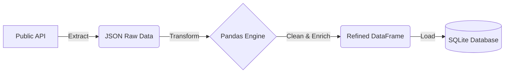

# ⚙️ Day 11: Production-Ready ETL Pipeline Framework

## 📝 Overview
This repository contains a modular, scalable ETL (Extract, Transform, Load) framework designed to demonstrate professional Data Engineering practices. It automates the process of fetching data from external APIs, refining it with Pandas, and loading it into a relational storage layer.

## 🏗️ Architecture


## 🚀 Key Engineering Features
- **Modular Design**: Separated concerns into `extract`, `transform`, and `load` modules for high maintainability.
- **Data Normalization**: Flattened nested JSON structures into a relational schema.
- **Error Handling & Logging**: Integrated Python `logging` to track pipeline health and catch API failures.
- **Data Enrichment**: Automated field splitting and email normalization for downstream analytics readiness.

## 🛠️ Tech Stack
- **Language**: Python 3.x
- **Data Manipulation**: Pandas
- **DB Interaction**: SQLAlchemy
- **Environment**: Modular architecture compatible with Airflow/Prefect orchestration.

## 🏃 Project Structure
```text
day-11-etl-pipeline/
├── data/               # Persistent data storage
├── pipeline/           # Modular logic
│   ├── extract.py      # API/CSV ingestion
│   ├── transform.py    # Business logic & cleaning
│   └── load.py         # DB loading logic
├── main.py             # Pipeline Orchestrator
└── pipeline.log        # Auto-generated execution logs
```

## 📊 How to Run
1. Install dependencies:
   ```bash
   pip install -r requirements.txt
   ```
2. Execute the pipeline:
   ```bash
   python main.py
   ```
3. Check `pipeline.log` for the execution trail and `data/warehouse.db` for the results.

---
*Developed as part of the 30-Day Recruiter Attraction Challenge.*
