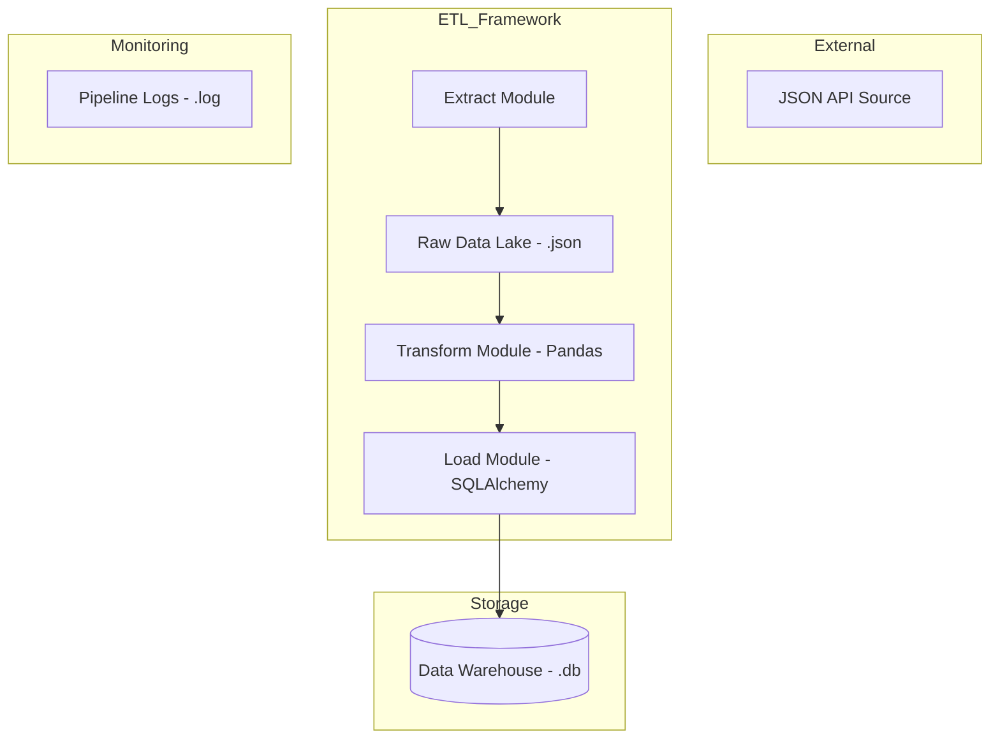

# ⚙️ Day 11: Production-Ready ETL Pipeline Framework

## 🌟 What is this Project?
This project is a **Modular ETL (Extract, Transform, Load) Framework** built with Python. It represents a real-world data engineering solution designed to automate the collection and refinement of data. Unlike simple one-off scripts, this framework is built using **Software Engineering best practices**, making it scalable, maintainable, and ready for production orchestration.

## 🎯 Purpose
The primary purpose of this project is to bridge the gap between "raw data" and "business intelligence."
- **Automation**: To eliminate manual data handling.
- **Reliability**: To ensure that data ingestion is consistent and error-tolerant.
- **Standardization**: To transform varied, nested API responses into a structured relational format that can be easily queried by analysts or BI tools like Tableau and Power BI.

## 📈 Use & Advantages
### Use Cases:
- **Financial Reporting**: Pulling daily currency or stock data for analysis.
- **Customer 360**: Aggregating user data from multiple microservices into a central warehouse.
- **Competitor Tracking**: Ingesting market data for price comparison.

### Key Advantages:
- **🔀 Modularity**: If the data source changes, you only update the `extract` module. If business logic changes, you only touch `transform`.
- **🛡️ Resilience**: Integrated logging ensures that if the pipeline fails at 3 AM, the logs tell you exactly why (API timeout, schema drift, etc.).
- **⚡ Performance**: Leverages the speed of `Pandas` for vectorized transformations.
- **📉 Resource Efficiency**: Uses `SQLAlchemy` to handle database connections efficiently, preventing memory leaks.

## 🛠️ How we built this: Step-by-Step
### Phase 1: Planning & Design (Non-Technical)
1. **Requirements Gathering**: We identified the need for a system that can handle nested JSON data (common with REST APIs).
2. **Schema Modeling**: We decided on a relational target schema that prioritizes readability (e.g., splitting a single `full_name` field into `first_name` and `last_name`).
3. **Architecture Mapping**: We mapped the 3-step flow: Source (API) -> Cache (JSON) -> Warehouse (SQLite).

### Phase 2: Technical Implementation
1. **Extraction (`extract.py`)**:
   - Used the `requests` library to fetch data.
   - Implemented a "Data Lake" simulation by saving raw JSON locally before processing. This allows for data "re-runs" without hitting the API again.
2. **Transformation (`transform.py`)**:
   - Used `Pandas` to flatten the nested JSON.
   - Cleaned the data: normalized emails to lowercase, handled missing values.
   - Enriched the data: Created new columns by parsing existing ones to make the data more "analytics-ready."
3. **Loading (`load.py`)**:
   - Established a connection to a SQLite database using `SQLAlchemy`.
   - Used the `to_sql` method with `if_exists='replace'` to ensure the warehouse stays up-to-date.
4. **Orchestration (`main.py`)**:
   - Built a high-level "Controller" that manages the sequence.
   - Configured global logging to capture every success and failure.

## 🏗️ Architecture Diagram

## 📋 Comprehensive Technical Breakdown
- **Language**: Python 3.12+
- **Libraries**: `requests` (Net), `pandas` (Data), `sqlalchemy` (SQL), `logging` (Ops).
- **Error Strategy**: Try-Except blocks at critical failure points (Web requests, DB writes).
- **Idempotency**: The pipeline can be run multiple times safely without creating duplicate database tables.

## 📽️ Live ETL Dashboard (Streamlit Integration)
To provide a "Live View" of the pipeline, I've added a **Streamlit Dashboard** that allows you to:
- **Trigger the Pipeline**: Manually kick off an ETL run from the UI.
- **Visual Log Updates**: See the step-by-step progress of the execution.
- **Data Visualization**: Directly query the resulting SQLite warehouse and see KPI metrics (Record counts, geolocation stats, etc.).

## 🏃 How to Run & Verify
1. **Setup**: `pip install -r requirements.txt`
2. **Launch Dashboard**: `streamlit run streamlit_app.py`
3. **Trigger**: Click **"🚀 Trigger ETL Pipeline"** in the sidebar.
4. **Verify**: Check `pipeline.log` for the detailed trail and the UI charts for the data insights.

## ☁️ Deploying to Streamlit Cloud
1. Push this repository to GitHub.
2. Go to [share.streamlit.io](https://share.streamlit.io/).
3. Connect your repo and set the main file to `streamlit_app.py`.
4. Experience the live data factory in your browser!

---
*Created by Meghana Mareedu | Day 11 of the 30-Day Recruiter Attraction Challenge*
